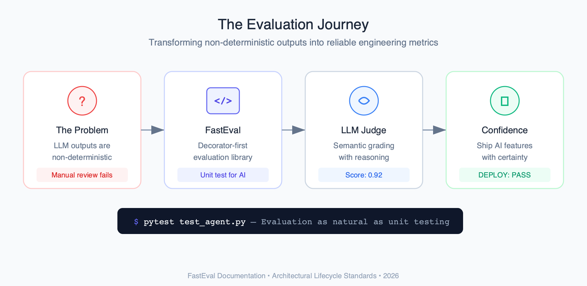
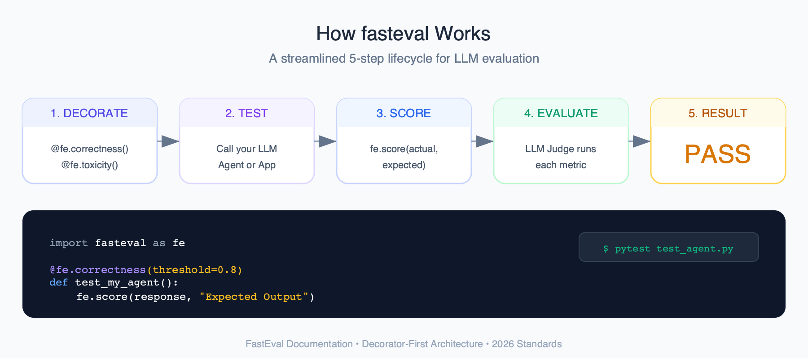
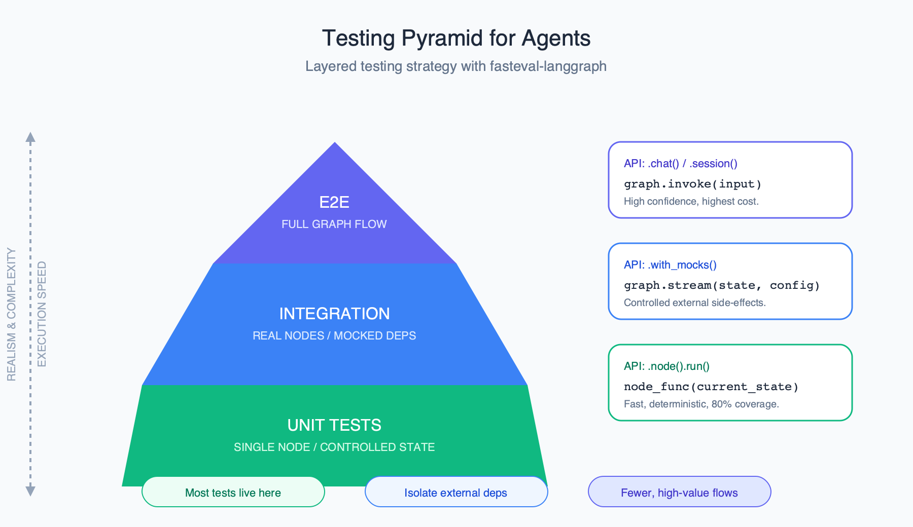

# fasteval

[](https://pypi.org/project/fasteval-core/)
[](https://pypi.org/project/fasteval-langgraph/)
[](https://pypi.org/project/fasteval-langfuse/)
[](https://pypi.org/project/fasteval-observe/)

[](https://github.com/intuit/fasteval/actions/workflows/ci.yml)
[](https://opensource.org/licenses/Apache-2.0)
[](https://fasteval.io)

A **decorator-first LLM evaluation library** for testing AI agents and LLMs. Stack decorators to define evaluation criteria, run with pytest. [Read the docs](https://fasteval.io/docs).

<p align="center">
  
</p>

## Features

- **50+ built-in metrics** -- stack `@fe.correctness`, `@fe.relevance`, `@fe.hallucination`, and more
- **pytest native** -- run evaluations with `pytest`, get familiar pass/fail output
- **LLM-as-judge + deterministic** -- semantic LLM metrics alongside ROUGE, exact match, JSON schema, regex
- **Custom criteria** -- `@fe.criteria("Is the response empathetic?")` for any evaluation you can describe in plain English
- **Multi-modal** -- evaluate vision, audio, and image generation models
- **Conversation metrics** -- context retention, topic drift, consistency for multi-turn agents
- **RAG metrics** -- faithfulness, contextual precision, contextual recall, answer correctness
- **Tool trajectory** -- verify agent tool calls, argument matching, call sequences
- **Reusable metric stacks** -- `@fe.stack()` to compose and reuse metric sets across tests
- **Human-in-the-loop** -- `@fe.human_review()` for manual review alongside automated metrics
- **Data-driven testing** -- `@fe.csv("test_data.csv")` to load test cases from CSV files
- **Pluggable providers** -- OpenAI (default), Anthropic, or bring your own `LLMClient`

## How It Works

<p align="center">
  
</p>

## Quick Start

```bash
pip install fasteval-core
```

Set your LLM provider key:

```bash
export OPENAI_API_KEY=sk-your-key-here
```

Write your first evaluation test:

```python
import fasteval as fe

@fe.correctness(threshold=0.8)
@fe.relevance(threshold=0.7)
def test_qa_agent():
    response = my_agent("What is the capital of France?")
    fe.score(response, expected_output="Paris", input="What is the capital of France?")
```

Run it:

```bash
pytest test_qa_agent.py -v
```

## Installation

```bash
# pip
pip install fasteval-core

# uv
uv add fasteval-core
```

### Optional Extras

```bash
# Anthropic provider
pip install fasteval-core[anthropic]

# Vision-language evaluation (GPT-4V, Claude Vision)
pip install fasteval-core[vision]

# Audio/speech evaluation (Whisper, ASR)
pip install fasteval-core[audio]

# Image generation evaluation (DALL-E, Stable Diffusion)
pip install fasteval-core[image-gen]

# All multi-modal features
pip install fasteval-core[multimodal]
```

## Usage Examples

### Deterministic Metrics

```python
import fasteval as fe

@fe.contains()
def test_keyword_present():
    fe.score("The answer is 42", expected_output="42")

@fe.rouge(threshold=0.6, rouge_type="rougeL")
def test_summary_quality():
    fe.score(actual_output=summary, expected_output=reference)
```

### Custom Criteria

```python
@fe.criteria("Is the response empathetic and professional?")
def test_tone():
    response = agent("I'm frustrated with this product!")
    fe.score(response)

@fe.criteria(
    "Does the response include a legal disclaimer?",
    threshold=0.9,
)
def test_compliance():
    response = agent("Can I break my lease?")
    fe.score(response)
```

### RAG Evaluation

```python
@fe.faithfulness(threshold=0.8)
@fe.contextual_precision(threshold=0.7)
def test_rag_pipeline():
    result = rag_pipeline("How does photosynthesis work?")
    fe.score(
        actual_output=result.answer,
        context=result.retrieved_docs,
        input="How does photosynthesis work?",
    )
```

### Tool Trajectory

```python
@fe.tool_call_accuracy(threshold=0.9)
def test_agent_tools():
    result = agent.run("Book a flight to Paris")
    fe.score(
        result.response,
        tool_calls=result.tool_calls,
        expected_tools=[
            {"name": "search_flights", "args": {"destination": "Paris"}},
            {"name": "book_flight"},
        ],
    )
```

### Multi-Turn Conversations

```python
@fe.context_retention(threshold=0.8)
@fe.conversation([
    {"query": "My name is Alice and I'm a vegetarian"},
    {"query": "Suggest a restaurant for me"},
    {"query": "What dietary restriction should they accommodate?"},
])
async def test_memory(query, expected, history):
    response = await agent(query, history=history)
    fe.score(response, input=query, history=history)
```

### Metric Stacks

```python
# Define a reusable metric stack
@fe.stack()
@fe.correctness(threshold=0.8, weight=2.0)
@fe.relevance(threshold=0.7, weight=1.0)
@fe.coherence(threshold=0.6, weight=1.0)
def quality_metrics():
    pass

# Apply to multiple tests
@quality_metrics
def test_chatbot():
    response = agent("Explain quantum computing")
    fe.score(response, expected_output=reference_answer, input="Explain quantum computing")

@quality_metrics
def test_summarizer():
    summary = summarize(long_article)
    fe.score(summary, expected_output=reference_summary)
```

## Plugins

| Plugin | Description | Install |
|--------|-------------|---------|
| [fasteval-langfuse](https://fasteval.io/docs/plugins/langfuse/overview) | Evaluate Langfuse production traces with fasteval metrics | `pip install fasteval-langfuse` |
| [fasteval-langgraph](https://fasteval.io/docs/plugins/langgraph/overview) | Test harness for LangGraph agents | `pip install fasteval-langgraph` |
| [fasteval-observe](https://fasteval.io/docs/plugins/observe/overview) | Runtime monitoring with async sampling | `pip install fasteval-observe` |

<p align="center">
  
</p>

## Local Development

```bash
# Install uv
brew install uv

# Create virtual environment and install all dependencies
uv sync --all-extras --group dev --group test

# Run the test suite
uv run tox

# Run tests with coverage
uv run pytest tests/ --cov=fasteval --cov-report=term -v

# Format code
uv run black .
uv run isort .

# Type checking
uv run mypy .
```

## Documentation

Full documentation is available at **[fasteval.io](https://fasteval.io)**.

- [Getting Started](https://fasteval.io/docs/getting-started/quickstart) -- installation and quickstart guide
- [Why FastEval](https://fasteval.io/docs/getting-started/introduction/why-fasteval) -- motivation and design philosophy
- [Core Concepts](https://fasteval.io/docs/core-concepts/decorators) -- decorators, metrics, scoring, data sources
- [Concepts](https://fasteval.io/docs/concepts/llm-as-judge) -- LLM-as-judge, scoring thresholds, evaluation strategies
- [LLM Metrics](https://fasteval.io/docs/llm-metrics/correctness) -- correctness, relevance, hallucination, and more
- [Deterministic Metrics](https://fasteval.io/docs/deterministic-metrics/exact-match) -- ROUGE, exact match, regex, JSON schema
- [RAG Metrics](https://fasteval.io/docs/rag-metrics/faithfulness) -- faithfulness, contextual precision/recall
- [Tool Trajectory](https://fasteval.io/docs/tool-tranjectory-metrics/tool-call-accuracy) -- tool call accuracy, sequence, argument matching
- [Conversation Metrics](https://fasteval.io/docs/conversation-metrics/context-retention) -- context retention, consistency, topic drift
- [Multi-Modal](https://fasteval.io/docs/multimodal/overview) -- vision, audio, image generation evaluation
- [Human Review](https://fasteval.io/docs/human-review/overview) -- human-in-the-loop evaluation
- [Cookbooks](https://fasteval.io/docs/cookbooks/rag-pipeline) -- RAG pipelines, CI/CD setup, prompt regression, production monitoring
- [Plugins](https://fasteval.io/docs/plugins/langfuse/overview) -- Langfuse, LangGraph, Observe
- [Advanced](https://fasteval.io/docs/advanced/custom-metrics) -- custom metrics, providers, output collectors, traces
- [API Reference](https://fasteval.io/docs/api-reference/decorators) -- decorators, evaluator, models, score

## Contributing

See [CONTRIBUTING.md](./CONTRIBUTING.md) for development setup, coding standards, and how to submit pull requests.

## License

Apache License 2.0 -- see [LICENSE](./LICENSE) for details.
